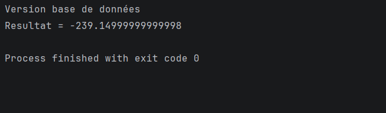
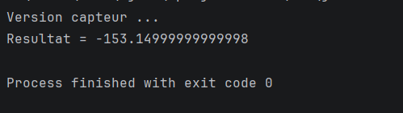

# Activit-Pratique-N-1---Injection-des-d-pendances
Un compte rendu en reprenant l'exemple traité dans les vidéos des deux dernières séances.
## Consignes :
 - Créer une repository Github
  - Déposer le lien du repository comme seul livrable dans classroom
  - Pour chaque période de  30 min environ, Effectuer un commit et un push
  - Pour le rapport, utiliser le fichier README.MD du repository
  - à la fin de la séance, Faire un dernier commit
  - Après vous continuez à compléter l'activité pratique
---
Ressources vidéo à utiliser 
``` 
https://www.youtube.com/watch?v=vOLqabN-n2k
```
---
## Partie 1 : (Voir support et vidéo)
#### 1 - Création de l'interface IDao une méthode getData
Au premier temps, nous avons créé les packages net.hamza.dao, net.hamza.metier et net.hamza.pres.
Ensuite, nous avons créé l’interface IDao à l’intérieur du package net.hamza.dao.
puis on ajouter la methode getData()
```java
double getData();
```
#### 2. Création d'une implémentation de cette interface 
On créer la class DaoImpl qui implimente l'interface IDao et redefini
la methode getData()
```java
public double getData() {
    System.out.println("Version de base de donneés");
    return 34; // exemple de temperature = 34
}
```
#### 3. Création de l'interface IMetier avec une méthode calcul
On créer l'interface IMetier avec la méthode calcule() dans la package net.hamza.metier.
```java
double calcul();
```
#### 4. Création d'une implémentation de cette interface en utilisant le couplage faible
On créer la classe MetierImpl qui impliment l'interface IMetier dans la package metier et recreer la methode
calcul().
```java
public double calcul() {
    double t = dao.getData();
    double res = t - 273.15;
    return res;
}
```
Puis on utilise l'interface IDao avec le couplage faible (n'est pas instensier l'attribut)
```java
private IDao dao;
```
et definis les methodes pour instencier l'attribut dao (injecter dans l'attribut dao un objet d'une class qui impliment l'interface IDao), il'y a 2 façons de faire ça : 
On utilisant setter et constructeur par défaut: 
```java
public MetierImpl () {
    
}
public void setDao(IDao dao) {
    this.dao = dao;
}
```
ou on utilise le constructeur par paramétre : 
```java
public MetierImpl (IDao dao) {
    this.dao = dao;
}
```
**Remarque : Utilise constructeur par paramétre est mieux et plus optimiser.**
#### 5. Faire l'injection des dépendances :
##### a. Par instanciation statique
On créer la class Pres1 qui va initialiser les objets DaoImpl et MetierImpl
et puis on faire l'injection des dépendances, on utilisant le constructeur par parametre
```java
DaoImpl d = new DaoImpl();
MetierImpl metier = new MetierImpl(d);
```
apres on afficher le resultats 
```java
System.out.println("Resultat = "+ metier.calcul());
```

<br/>**Remarque : le probleme de cette methode d'injection est que la class Pres1 est pas feremer á la modification, parce que il y'a un dépandance fort entre la et les classes
DaoImpl et MetierImpl**
##### b. Par instanciation dynamique
Le probleme de l'instaciation statique est que si on'a une nouvelle source de donneées c-a-d DaoImplV2, il faut modifier 
le fichier Pres1 => c'est déja bon qu'il faut juste modifier une seule class (design pattern factory (class Pres1)) mais c'est
mieux si on'a pas besoin de modifier le fichier Pres1.
Aussi la class DaoImplV2 impliment l'interface IDao, et sa methode getData():
```java
public double getData() {
    System.out.println("Version capteur ...");
    return 120;
}
```
Et si on change la class Pres1 par :
```java
DaoImplV2 d = new DaoImplV2();
```
En va voir qu'il s'a marche : <br/>
 <br/>
On créer le class Pres2 qui va fermer a la modification et ouvert a l'extension et puis on créer le fichier de
configuration config.txt dans la racine de projet. <br/>
Dans le fichier config.txt on specifier les class qu'on va utiliser
```text
net.hamza.dao.DaoImpl
net.hamza.metier.MetierImpl
```
puis lire le fichier via la class Pres2
````java
Scanner sc = new Scanner(new File("config.txt"));
String daoClassName = sc.nextLine();
Class cDao = Class.forName(daoClassName); //Charge en memoire la class de premier ligne
IDao dao = (IDao) cDao.newInstance(); // instancier la class Dao avec constructeur par defaut      
System.out.println(dao.getData());
````
Donc il souffit de juste changer le fichier config.txt, et le prgramme va charger les donnes dans un autre source.
Alors on pass au methode calcul, la deuxieme ligne de fichier config.txt, on ajoute dans la class Pres2
```java
String metierClassName = sc.nextLine();
Class cMetier = Class.forName(metierClassName);
IMetier metier = (IMetier) cMetier.getConstructor(IDao.class).newInstance(dao); // constructeur par parametre
System.out.println("Res = " + metier.calcul());
```
Remarque : tu peut utiliser constructeur par defaut avec setter au lieu de constructeur par parametre. <br/>
Maintenant la class Pres2 est totalement fermer a la modification et ouvert a l'extension

##### c. En utilisant le Framework Spring
##### i. Version XML
Au premier on télécharger les dependances par ajouter les dans le fichier pom.xml
```xml
<dependencies>
    <dependency>
        <groupId>org.springframework</groupId>
        <artifactId>spring-core</artifactId>
        <version>7.0.4</version>
        <scope>compile</scope>
    </dependency>
    <dependency>
        <groupId>org.springframework</groupId>
        <artifactId>spring-context</artifactId>
        <version>7.0.4</version>
        <scope>compile</scope>
    </dependency>
    <dependency>
        <groupId>org.springframework</groupId>
        <artifactId>spring-beans</artifactId>
        <version>7.0.4</version>
        <scope>compile</scope>
    </dependency>
</dependencies>
```
Puis on reload le projet pour obliger maven de télécharger les depandances.<br/>
et creer un fichier xml spring config.xml dans le dossier java/ressources
```xml
<bean id="dao" class="net.hamza.dao.DaoImpl"></bean>
<bean id="metier" class="net.hamza.metier.MetierImpl">
    <property name="dao" ref="dao"></property>
</bean>
```
Puis on ajoute la nouvelle classe PresSpringXml qui base sur le nouveau fichier config.xml
```java
ApplicationContext springContext = new ClassPathXmlApplicationContext("config.xml");
IMetier metier = (IMetier) springContext.getBean("metier");
System.out.println("Res = "+ metier.calcul());
```
##### ii. Version annotations (@)
Au premier ajouter l'annotation @Component au classe DaoImpl et MetierImpl et 
@Autowired au attributes de classe MetierImpl juste apres la declaration d'objet
IDao, pour faire l'injection automatique.
<br/> Si tu n'a pas ecrit @Autowired dans la classe MetierImpl il va marche ssi 
elle contient un seul constructeur, si elle a 2 il va génerer un exception.
<br/> Puis on créer une nouvelle classe PresSpringAnnotation
```java
ApplicationContext applicationContext = new AnnotationConfigApplicationContext("net.hamza");
IMetier metier = applicationContext.getBean(IMetier.class);
System.out.println("Res = "+metier.calcul());
```
Maintenant si on ajoute la classe DaoImplV2 (c-a-d on ajoute @Component("dao2")), tu va avoir un exception car
@Autowired injecter automatique un objet de type IDao mais on a 2 classe qui impliment cette interface.
<br/> dans ce cas on utilise l'annotation @Qualifier("le-nom-de-component-selectionner")